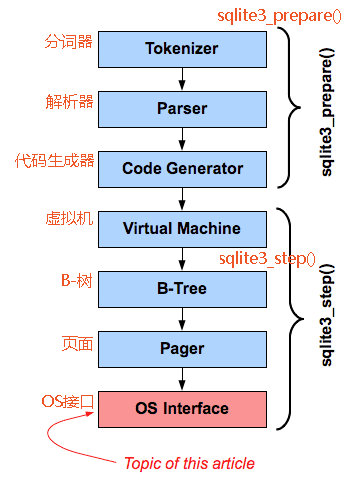

前言：OS层，主要是为了提高可移植性而设计出来的，其底层是基于个**VFS**(虚拟文件系统)的模块来实现。  

原文：[The SQLite OS Interface or "VFS"](https://www.sqlite.org/vfs.html)   
中译：celns 
***

# SQLite的操作系统接口或“ VFS”
# 1. 简介(Introduction)
本文介绍了SQLite OS可移植性层或“ VFS”，这是SQLite实现堆栈底部的模块，该模块提供了跨操作系统的可移植性。

# 2. VFS与其他SQLite模块的关联(The VFS In Relation To The Rest Of SQLite)

  

### SQLite库的内部组织可以视为如上图所示的模块堆栈。  
**Tokenizer**，**Parser**和**Code Generator**组件用于处理SQL语句，并将其转换为虚拟机语言或字节码的可执行程序。  
### 粗略地说，这三层实现了 sqlite3_prepare_v2()。
* **Virtual Machine**模块负责运行SQL语句字节代码。  
* **B-Tree**模块将数据库文件组织到具有有序键和对数性能的多个键/值存储中。  
* **Pager**模块负责将数据库文件的页面加载到内存中，以实现和控制事务，并创建和维护日记文件，以防止崩溃或电源故障后数据库损坏。  
* **OS Interface**是一层抽象，提供了一组通用的例程，以使SQLite适应在不同的操作系统上运行。  
### 粗略地说，最下面的四层实现了 sqlite3_step()。

**OS Interface（也称为“VFS”，虚拟文件系统）**是使SQLite可跨操作系统移植的原因。  
每当SQLite中的任何其他模块需要与操作系统通信时，它们都会调用**VFS**中的方法。然后，**VFS**调用满足请求所需的特定于操作的代码。  
因此，将SQLite移植到新的操作系统只需编写一个新的OS接口层或“VFS”即可。

# 3. 多个VFS(Multiple VFSes)
标准的SQLite源代码树包含用于**UNIX**和**Windows**的内置VFS。  
可以使用`sqlite3_vfs_register()`接口在启动时或运行时添加备用VFS 。

可以同时注册多个VFS。每个VFS都有一个唯一的名称。同一进程中的单独数据库连接可以同时使用不同的VFS。  
因此，如果单个数据库连接使用**ATTACH**命令打开了多个数据库文件，则每个连接的数据库可能正在使用不同的VFS。

## 3.1 标准Unix VFS( Standard Unix VFSes)
Unix构建带有多个内置VFS。Unix的默认VFS称为“unix”，并且在大多数应用程序中使用。可以在unix中找到的其他VFS（取决于编译时选项）包括：

* `unix-dotfile`使用点文件锁定而不是POSIX查询锁定。  
  
* `unix-excl`获取并持有数据库文件的排他锁，以防止其他进程访问数据库。还将wal-index保留在堆中，而不是共享内存中。  
  
* `unix-none`所有文件锁定操作均为无操作。  
  
* `unix-namedsem`使用命名信号量进行文件锁定。仅限于VXWorks。

各种UNIX VFS的区别仅在于它们**处理文件锁定的方式不同**-它们彼此共享大多数实现，并且都位于同一SQLite源文件 `os_unix.c`中。  
请注意，除了“ unix”和“ unix-excl”以外，各种unix VFS都使用不兼容的锁定实现。如果两个进程正在使用不同的unix VFS访问同一SQLite数据库，则它们可能看不到彼此的锁，并且可能最终相互干扰，从而导致数据库损坏。特别是“ unix-none” VFS根本不锁定，如果同时由两个或多个数据库连接使用，则很容易导致数据库损坏。  
鼓励程序员仅使用“**unix**”或“**unix-excl**”

## 3.2 标准Windows VFS(Standard Windows VFSes)
Windows版本还带有多个内置VFS。默认的Windows VFS称为“win32”，并在大多数应用程序中使用。Windows版本中可能找到的其他VFS包括：

* `win32-longpath`类似于“ win32”，除了路径名的最大长度为65534字节，而“ win32”中的路径名最大为1040字节。

* `win32-none`所有文件锁定操作均为无操作。

* `win32-longpath-none` “ win32-longpath”和“ win32-none”的组合-支持长路径名，并且所有锁定操作均为无操作。

与unix一样，各种Windows VFS的大多数代码实现都是共享的。

## 3.3 指定要使用的VFS(Specifying Which VFS To Use)
### 始终有一个VFS是默认的VFS。  
在UNIX系统上，“unix”VFS作为默认值出现，在Windows上为“ win32”。如果未执行其他任何操作，则新的数据库连接将使用默认的VFS。

可以通过使用带有第二个参数1的`sqlite3_vfs_register()`接口注册或重新注册VFS来更改默认VFS。  
因此，如果（unix）进程希望始终使用“ unix-nolock” VFS代替“ unix”，则以下代码将起作用：  

`sqlite3_vfs_register（sqlite3_vfs_find("unix-nolock"), 1);`  

也可以将备用VFS指定为`sqlite3_open_v2()`函数的第4个参数 。例如：

`int rc = sqlite3_open_v2("demo.db", &db, SQLITE_OPEN_READWRITE, "unix-nolock");`  

最后，如果启用了URI文件名，则可以使用URI上的 `“vfs=“` 来指定备用VFS。这种方式同样适用于`sqlite3_open()` ，`sqlite3_open16()` ，`sqlite3_open_v2()` ，以及当一个新的数据库ATTACH -ed到现有的数据库连接的适合。例如：

`ATTACH 'file:demo2.db?vfs=unix-none' AS demo2;`  

URI指定的VFS具有最高优先级。之后是VFS，它指定为`sqlite3_open_v2()`的第四个参数。如果未指定其他VFS，则使用默认VFS。

## 3.4 VFS填充程序(VFS Shims) 
从SQLite堆栈的较高层的角度来看，每个打开的数据库文件仅使用一个VFS。但是实际上，特定的VFS可能只是完成实际工作的另一个VFS的薄壳。我们将薄壳VFS​​称为“填充程序”。

填充程序的一个简单示例是“ vfstrace” VFS。这是一个VFS（在 `test_vfstrace.c` 源文件中实现），它将与每个VFS方法调用关联的消息写入日志文件，然后将控制权转交给另一个VFS进行实际工作。

## 3.5 其他示例VFS(Other Example VFSes)
以下是公共SQLite源代码树中可用的其他VFS实现：

`appendvfs.c`-此VFS允许将SQLite数据库附加到其他文件的末尾。例如，可将其用于将SQLite数据库附加到可执行文件的末尾，以使可执行文件可以在需要时轻松地定位在可执行文件所在的位置。在 命令行shell如果与--append选项启动将使用此VFS。

`test_demovfs.c`-该文件实现了一个非常简单的名为“ demo”的VFS，该文件使用POSIX函数，例如open()，read()，write()，fsync()，close()，fsync()，sleep()，time ()等。该VFS仅适用于UNIX系统。但是，它不能替代Unix平台上默认使用的标准“ unix” VFS。故意将“演示” VFS保持非常简单，以便将其用作学习工具或用作构建其他VFS或将SQLite移植到新操作系统的模板。

`test_quota.c`-该文件实现了一种称为“ quota”的填充程序，该填充程序对数据库文件集合实施了累积文件大小限制。辅助接口用于定义“配额组”。配额组是一组名称都与GLOB模式匹配的文件（数据库文件，日志和临时文件）。跟踪每个配额组中所有文件的大小总和，如果该总和超过为配额组定义的阈值，则调用回调函数。该回调可能会增加阈值，或者可能导致超出配额的操作失败并显示 SQLITE_FULL错误。此垫片的用途之一是用于在Firefox中对应用程序数据库实施资源限制。

`test_multiplex.c`-该文件实现了一个填充程序，该填充程序允许数据库文件超过基础文件系统的最大文件大小。该填充程序提供了与SQLite的上六层的接口，使它看起来好像正在使用非常大的文件，实际上，每个这样的大文件在基础系统上都被拆分为许多较小的文件。例如，此填充程序已用于允许数据库在FAT16文件系统上增长到大于2吉字节。

`test_onefile.c`-该文件实现了名为“ fs”的演示VFS，该示例显示了如何在缺少文件系统的嵌入式设备上使用SQLite。内容直接写入基础媒体。从此演示代码派生的VFS可以由数量有限的闪存的小工具使用，以使SQLite充当设备上闪存的文件系统。

`test_journal.c`-该文件实现了SQLite测试期间使用的填充程序，该填充程序验证数据库和回滚日志以正确的顺序写入并在适当的时间进行“同步”，以确保很难从断电中恢复数据库随时重置。填充程序检查数据库和回滚日记帐的操作中的几个不变量，如果违反了任何这些不变量，则会引发异常。这些不变量又确保了数据库始终是可恢复的。使用此填充程序运行大量测试用例可进一步确保SQLite数据库不会因意外的电源故障或设备重置而损坏。

`test_vfs.c`-此文件实现了可用于模拟文件系统故障的填充程序。在测试过程中使用此填充程序来验证SQLite对硬件故障或对其他错误情况（例如，在实际系统上难以测试的文件系统空间用尽）的合理响应。

核心SQLite源代码库和可用扩展中都有其他VFS实现。上面的列表并不意味着详尽无遗，仅表示可以使用VFS接口实现的功能种类。

# 4. VFS的泛化(VFS Implementations)
通过子类化三个对象来实现新的VFS：

* `sqlite3_vfs`
* `sqlite3_io_methods`
* `sqlite3_file `

一个`sqlite3_vfs`对象定义VFS和芯的方法实现该接口到操作系统，如检查的文件的存在，删除文件，创建文件和开口和用于读取和/或写入，转换文件名到其规范的名称形成。`sqlite3_vfs`对象还包含用于从所述操作系统获得随机性，用于悬挂的处理（睡眠）和用于确定当前日期和时间的方法。

`sqlite3_file`对象代表一个打开的文件。`sqlite3_vfs`的xOpen方法在 打开文件时构造一个`sqlite3_file`对象。`sqlite3_file`保持它被打开，而跟踪文件的状态。

该`sqlite3_io_methods`对象包含用于交互与打开的文件的方法。每个`sqlite3_file`都包含一个指向`sqlite3_io_methods`对象的指针，该对象适合于它所代表的文件。`sqlite3_io_methods`对象包含的方法做事情，如从文件读取和写入，截断文件，将刷新到永久存储的任何变化，找到该文件的大小，锁定和解锁文件，并关闭文件和销毁`sqlite3_file`对象。

为新的VFS编写代码涉及为`sqlite3_vfs`对象构造一个子类，然后使用对`sqlite3_vfs_register()`的调用来注册该VFS对象。VFS实现还为`sqlite3_file`和`sqlite3_io_methods`提供了子类，但是这些对象未直接在SQLite中注册。  
相反， `sqlite3_file`对象从的XOPEN方法返回 `sqlite3_vfs`和`sqlite3_file`对象指向的一个实例`sqlite3_io_methods`对象。