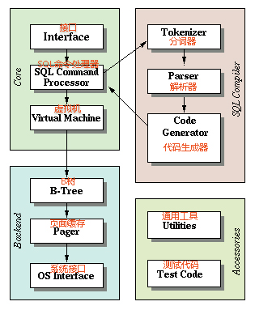

前言：官方文档作为第一手参考资料，必然是一个了解开源项目的第一手段（除非文档烂的一批）。所幸，对于SQLite来说，其文档还是不错的，包含了足够的信息。  

原文：[Architecture of SQLite](https://www.sqlite.org/arch.html)   
中译：celns 
***
# 总览  

### SQLite的工作方式是将`SQLtext`编译为**bytecode**，然后使用虚拟机运行该字节码。  
* `sqlite3_prepare_v2()`和相关接口充当SQL文本转换成<u>**bytecode**</u>的编译器。  
* `sqlite3_stmt`对象是使用实行单一SQL语句的单个字节码程序的容器。  
* `sqlite3_step()`接口传递一个<u>**bytecode**</u>程序到虚拟机，并运行该程序。
# 接口(Interface)
### 大多数C语言接口都可以在源文件`main.c`，`legacy.c`和`vdbeapi.c`中找到。 
`sqlite3_get_table()`例程在`table.c`中实现。`sqlite3_mprintf()`在`printf.c`里面可以找到。`sqlite3_complete()`在`complete.c`中。**TCL Interface**是在`tclsqlite.c`中。

为了避免名称冲突，SQLite库中的所有外部符号都以前缀`sqlite3`开头。这些供外部使用的符号（换句话说，构成SQLite API的那些符号）添加了一个下划线，因此以`sqlite3_`开头。

扩展API有时会在下划线之前添加4扩展名。例如： `sqlite3rbu_`或`sqlite3session_`。  

# 分词器(Tokenizer)
当要解析包含SQL语句的字符串时，首先将其发送到**Tokenizer**里。**Tokenizer**将SQL文本拆分为**tokens**，并将这些**tokens**逐个交给**parser(解析器)**。  
**Tokenizer**可在`tokenizer.c`中找到。

要注意，让**Tokenizer**调用**parser**会更好，因为这样就是线程安全的，而且速度更快。
# 解析器(Parser)
**Parser**根据**tokens**的上下文为**tokens**分配含义。SQLite的**Parser**是由<u>**Lemon parser generator**</u>生成的。  
在`parse.y`中可以找到驱动Lemon, 并定义SQLite可以理解的SQL语言的语法文件。  
因为Lemon是一个通常在开发机上找不到的程序，所以Lemonite的完整源代码（只有一个C文件）包含在SQLite发行版中的子目录***tool***中。
# 代码生成器(Code Generator)
`Parser`将`tokens`组装成`Parser Tree`后，`CodeGenerator`就会分析`Parser Tree`并生成执行SQL语句工作的`bytecode`。`prepared statement`对象是此`bytecode`的容器。  

**Code Generator**有包含了许多文件： `attach.c`， `auth.c`， `build.c`， `delete.c`， `expr.c`， `insert.c`， `pragma.c`， `select.c`， `trigger.c`， `update.c`， `vacuum.c`， `where.c`， `wherecode.c`和 `whereexpr.c`。 

`expr.c`处理表达式的代码生成。   
**`where*.c`**处理**SELECT**，**UPDATE**，**DELETE**语句上**WHERE**子句的代码生成。  
`attach.c`， `delete.c`，`insert.c`，`select.c`， `trigger.c` `update.c`和`vacuum.c`顾名思义，处理代码生成的具有SQL语句（这些文件中的每个文件都根据需要在`expr.c`和`where.c`中调用例程。）  
所有其他SQL语句都从`build.c`中进行编码。  
`auth.c`实现`sqlite3_set_authorizer()`的功能。  
**Code Generator**，尤其是`where*.c` 和`select.c`中的逻辑，有时被称为<u>**query planner**</u>(查询计划器)。对于任何特定的SQL语句，可能有数百，数千或数百万种不同的算法来计算答案。<u>**query planner**</u>可以说是一种AI，致力于从数百万种选择中选择最佳算法。
# 字节码引擎(Bytecode Engine)
由**Code Generator**创建的<u>**bytecode**</u>程序由虚拟机运行。  

虚拟机本身完全包含在单个源文件`vdbe.c`中。`vdbe.h`头文件定义了虚拟机和SQLite库的其余部分之间的接口。  
`vdbeInt.h`其定义了虚拟机本身的私有结构体和接口。其他各种**`vdbe*.c`**文件都是虚拟机的帮助程序。  
`vdbeaux.c`文件包含了由虚拟机和接口模块中使用的通用工具。  
`vdbeapi.c`文件包含了外部接口，如 `sqlite3_bind_int()`和`sqlite3_step()`。  
各个值（字符串，整数，浮点数和BLOBs）存储在名为**“Mem”**的内部对象中，该对象在`vdbemem.c`实现。  

SQLite使用对C语言例程的回调来实现SQL函数。其内置的SQL函数都是以这种方式实现的。  
大多数内置SQL函数（例如`abs()`，`count()`， `substr()`等）都可以在`func.c`源文件中找到。日期和时间转换功能位于`date.c`中。某些功能（例如`coalesce()`和`typeof()`）由**Code Generator**直接实现为<u>**bytecode**</u>。
# B树(B-Tree)
使用在`btree.c`中的B树实现在磁盘上维护SQLite数据库。数据库中的每个表和索引都使用单独的B树。所有B树都存储在同一磁盘文件中。<u>**file format**</u>的细节是稳定，良好定义并且保证是前向兼容的。
B-tree子系统和其余SQLite库的接口由头文件`btree.h`定义。
# 页面缓存(Page Cache)
B树模块以固定大小的页面从磁盘上请求信息。  
默认的<u>**page_size**</u>为4096字节，但也可是512到65536字节之间的任意2次幂。**Page Cache**负责读取，写入和缓存这些页面。**Page Cache**还提供回滚和原子提交抽象，并负责锁定数据库文件。  
B树驱动程序从**Page Cache**中请求特定页面，并在想要修改页面或提交或回滚更改时通知**Page Cache**。**Page Cache**处理所有混乱的细节，以确保快速，安全，高效地处理请求。
**Primary Page Cache**的实现位于`pager.c`文件中。   
<u>**WAL mode**</u>逻辑在单独的 `wal.c`中。  
内存中缓存由 `pcache.c`和`pcache1.c`文件实现。  
**Page Cache**子系统和其余SQLite之间的接口由头文件`pager.h`定义。
# 操作系统接口（OS Interface）
为了提供跨操作系统的可移植性，SQLite使用了称为<u>**VFS**</u>的抽象对象。  
每个<u>**VFS**</u>提供了用于打开，读取，写入和关闭磁盘上文件的方法，以及用于其他特定于OS的任务的方法，例如查找当前时间或获取随机性以初始化内置的伪随机数生成器。  
SQLite当前为UNIX（在`os_unix.c`文件中）和Windows（在`os_win.c`文件中）提供<u>**VFS**</u>。
# 工具(Utilities)
内存分配，不区分大小写的字符串比较例程，可移植的文本到数字的转换例程以及其他工具位于`util.c`中。  
**Parser**使用的符号表由`hash.c`中的哈希表维护。  
`utf.c`包含Unicode转换子程序。SQLite的有它自己的私有实现的`printf()`（带有一些扩展）在`printf.c`中，伪随机数生成器（PRNG）在`random.c`中。
# 测试代码(Test Code)
“src/”文件夹中，名称以test开头的文件, 仅用于测试，并不包含在标准库中。

